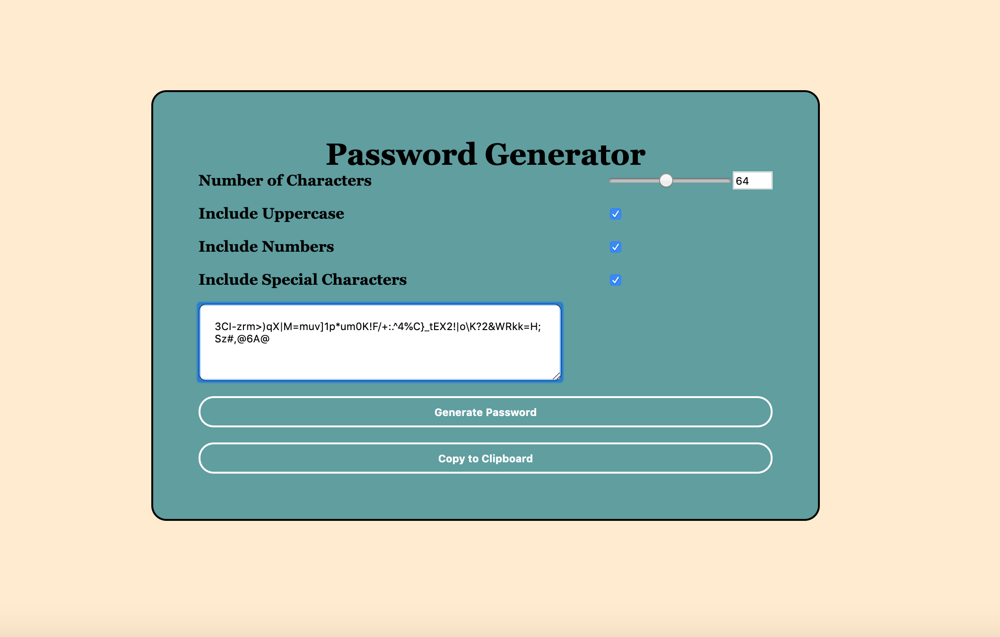

# Password Generator

**Link to the deployed GitHub pages URL**
https://faduma92.github.io/Password-Generator/ 

**Screenshot of the web application**

The purpose of this application is for companies that handle large amounts of sensitive data to have a way to generate strong passwords quickly and effortlessly saving employees time and ensuring secure access to data.

The application validates user input and ensures that at least one character type is selected. The user will then be presented with a password matching the selected criteria. 

The application has a clean and polished user interface and is responsive, ensuring that it adapts to multiple screen sizes.

I have also given the user the option to copy paste their secure password to their clipboard. 

